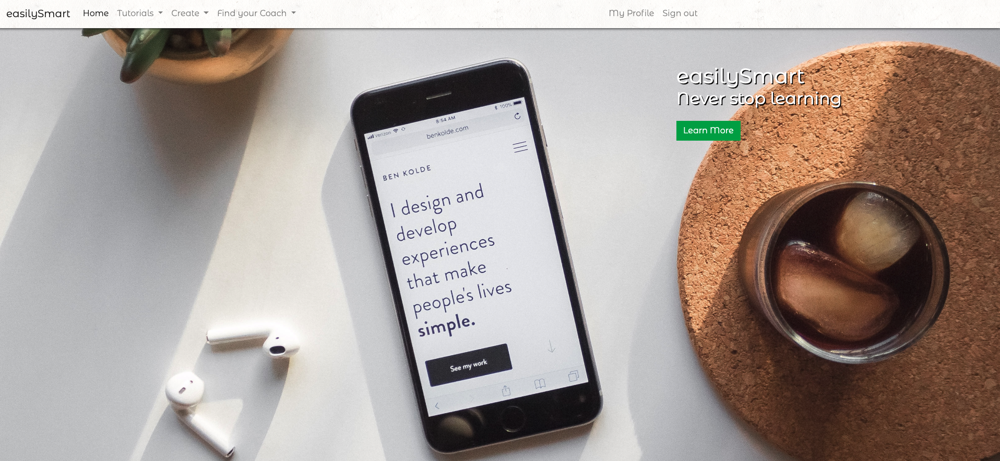

# easilysmart 

This application is built by using Ruby on Rails, Javascript, and jQuery.
This project allows the user to create tutorials to help people that need guidance with their smartphone. This project also allows user to become a coach to give one on one lessons.
Here is a live feed of the website. [here](https://easilysmart-saralegui.herokuapp.com) If you would like to create a account and try, go right ahead.

# Features: 

* Contains a Stripe API which is a secure payment method

* Devise is used for user authentication and sign-in forms, could be used for email as well.

* Carrierwave is used for aws.

* Bootstrap is also used in this application

* Postgresql is the database that is being used in this application.

